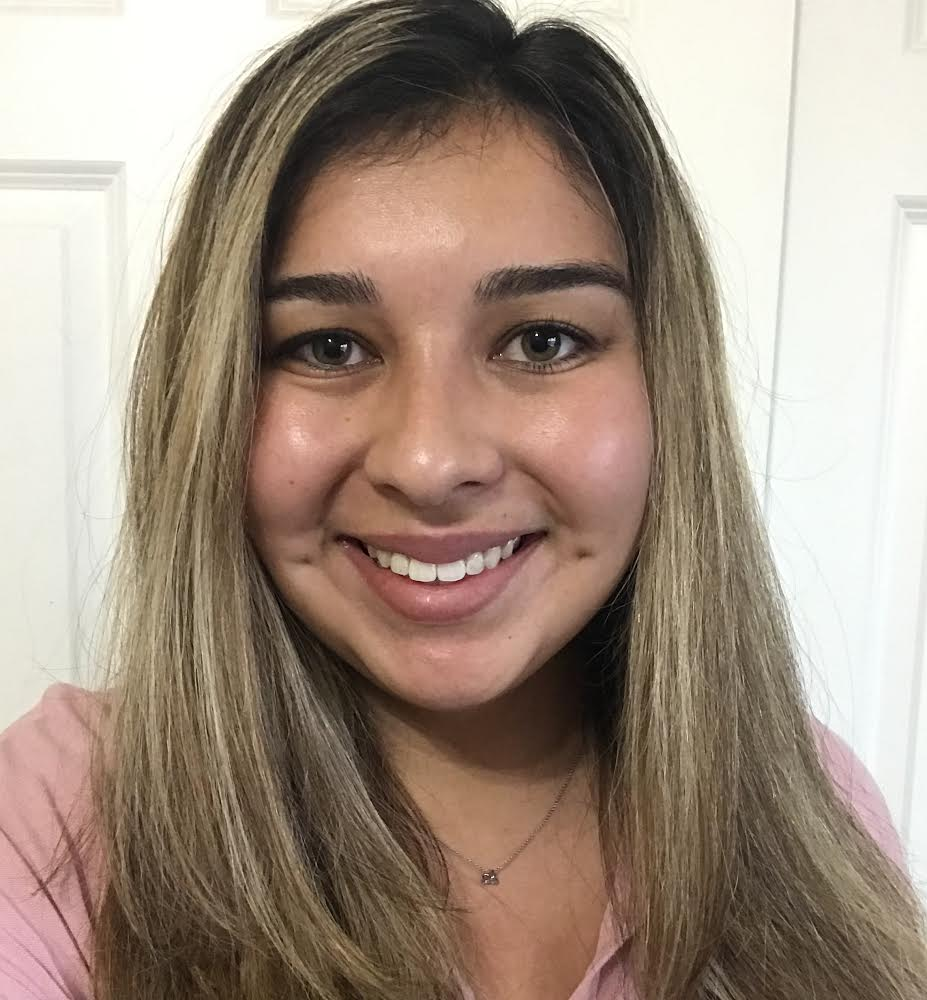

```{r setup, include=FALSE}
knitr::opts_chunk$set(echo = FALSE)
```


```{r out.width='150px', echo=FALSE}

```

email: catalmm1@uci.edu  
github: [CatalinaMedina](https://github.com/CatalinaMedina)  
Statitics PhD Student  
University of California, Irvine  
